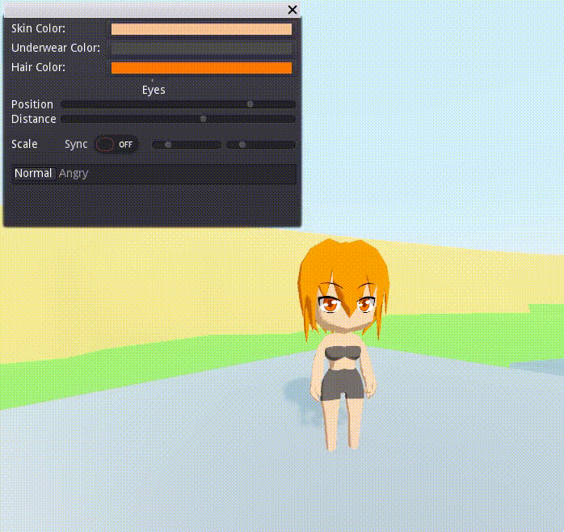
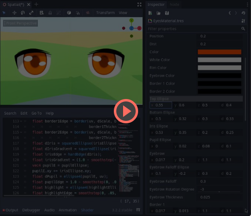
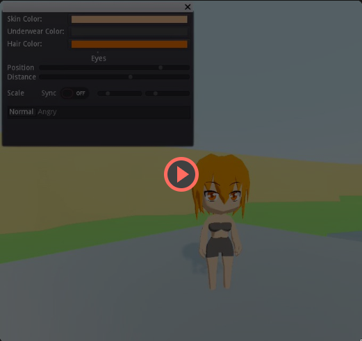

procedurally generated anime eyes shader

# usage
* put `AnimuEyes.shader` in your project, create a ShaderMaterial that loads it
* assign the ShaderMaterial to your model and adjust the uvArea (ideally get the exact uv values
  from blender or something). for cleaner uv mapping, add an extra surface to your model that's
  specially UV mapped for the eyes so you don't have to adjust uvArea or worry about deformation
* play with parameters, have fun
* if you already have a bunch of shaders stacked together, try to make the eyes the last pass
